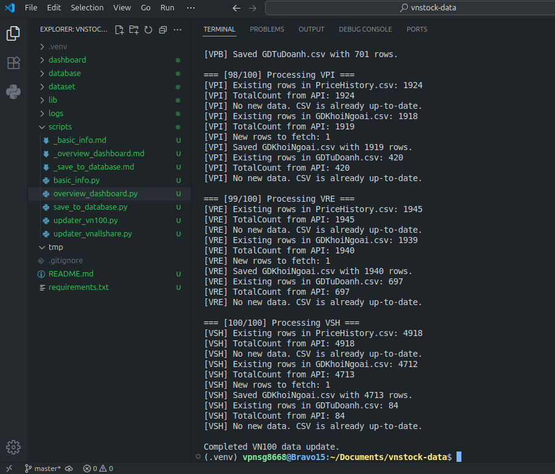
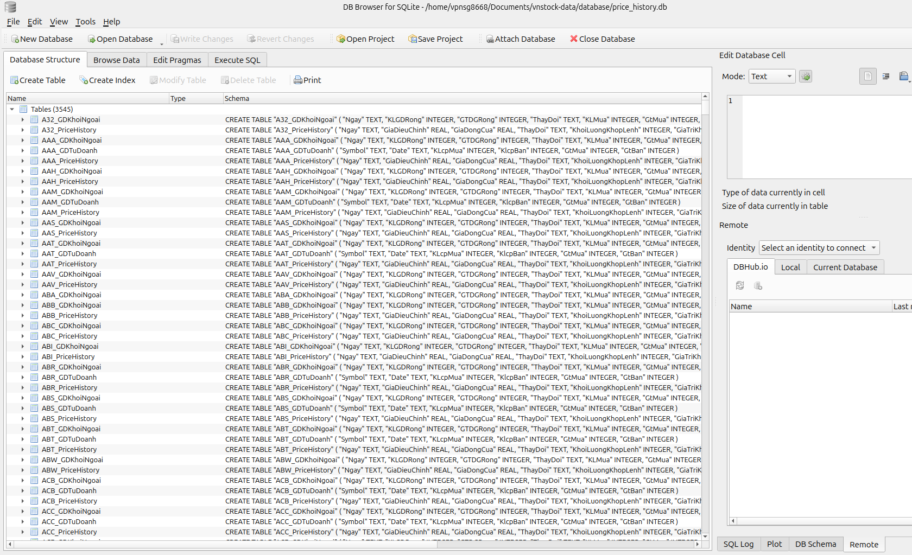
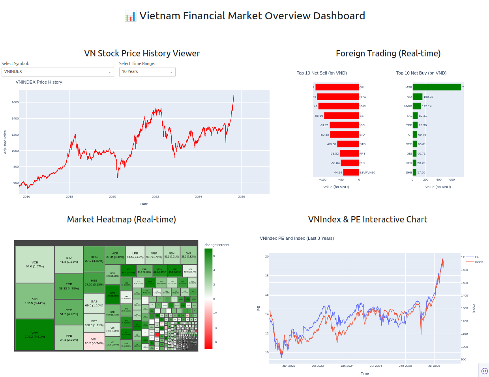
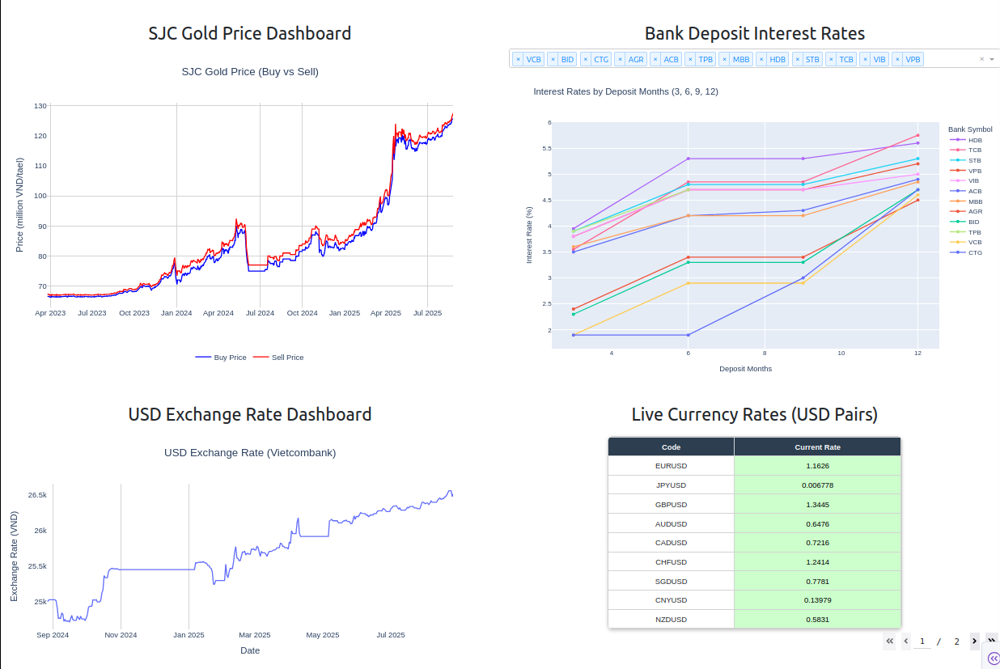

# VNStock Data Warehouse

## Giới thiệu

VNStock-Data là một dự án **data warehouse cho dữ liệu chứng khoán Việt Nam**, thu thập, lưu trữ và trực quan hóa dữ liệu từ nhiều nguồn khác nhau.
Dự án bao gồm:
- Thu thập dữ liệu cơ bản về ngân hàng, công ty chứng khoán, quỹ đầu tư, ngành nghề, công ty niêm yết.
- Thu thập dữ liệu lịch sử giá cổ phiếu và giao dịch.
- Lưu trữ dữ liệu trong SQLite.
- Trực quan hóa dữ liệu qua Dashboards.

---

## Cấu trúc dự án

```

├── dashboard/                # Các module Dash hiển thị dữ liệu
│   ├── dash_bank_deposit_rate.py
│   ├── dash_chart_header.py
│   ├── dash_foreign_trading.py
│   ├── dash_goldsjc_price.py
│   ├── dash_heatmap.py
│   ├── dash_live_currency_rate.py
│   ├── dash_price_history.py
│   ├── dash_usd_exchange_rate.py
│   ├── dash_vnindex_pe.py
│   └── __init__.py

├── database/                 # SQLite Database
│   ├── basic_info.db
│   └── price_history.db

├── dataset/                  # Dữ liệu thô CSV
│   ├── basic_info/
│   │   ├── banks_info.csv
│   │   ├── brokers_info.csv
│   │   ├── companies_vn100.csv
│   │   ├── companies_vnallshare.csv
│   │   ├── exchange_info.csv
│   │   ├── funds_info.csv
│   │   └── sectors_info.csv
│   ├── [Symbol]       # Ví dụ: BID, DHG, VCB
│   │   ├── GDKhoiNgoai.csv
│   │   ├── GDTuDoanh.csv
│   │   └── PriceHistory.csv

├── lib/                      # Thư viện nội bộ
│   ├── data_collector.py      # Thu thập dữ liệu từ API
│   └── **init**.py

├── logs/                     # File log
│   ├── data_collector_log.txt
│   └── save_to_database.txt

├── scripts/                  # Script quản lý và ETL dữ liệu
│   ├── basic_info.py
│   ├── save_to_database.py
│   ├── overview_dashboard.py
│   ├── updater_vn100.py
│   └── updater_vnallshare.py

├── tmp/                      # Thư mục tạm
├── README.md
└── requirements.txt

````

---

## Module chi tiết

### 1. basic_info.py

Script ETL để **thu thập dữ liệu cơ bản** từ API của CafeF và SSI, xuất ra CSV trong `dataset/basic_info/`.

- Các dữ liệu thu thập:
  - Ngân hàng (`banks_info.csv`)
  - Công ty chứng khoán (`brokers_info.csv`)
  - Quỹ đầu tư (`funds_info.csv`)
  - Ngành nghề (`sectors_info.csv`)
  - Danh sách công ty niêm yết (`companies_vnallshare.csv`)

- Tính năng chính:
  - Extract dữ liệu từ API.
  - Transform: lọc, sắp xếp, xử lý ngày tháng.
  - Load: xuất CSV chuẩn hóa.

### 2. save_to_database.py

Script **quản lý và đồng bộ dữ liệu vào SQLite**.

- Khởi tạo database: `basic_info.db` & `price_history.db`
- Import dữ liệu từ CSV vào database tương ứng, loại bỏ trùng lặp.
- Ghi log chi tiết vào `logs/save_to_database.txt`.

### 3. overview_dashboard.py

Dashboard tổng quan thị trường tài chính Việt Nam, hiển thị:
- Giá chứng khoán & giao dịch nước ngoài
- Heatmap & VNIndex PE
- Giá vàng SJC & lãi suất ngân hàng
- Tỷ giá USD & tỷ giá tiền tệ trực tiếp

- Mỗi dashboard con là module riêng (`layout` + `register_callbacks`) để dễ quản lý.
- Layout sử dụng Bootstrap grid, responsive.
- Chạy server Dash trên cổng 8050.

---

## Luồng dữ liệu

1. `lib/data_collector.py`: thu thập dữ liệu từ các API.
2. `scripts/basic_info.py`: ETL dữ liệu cơ bản → CSV.
3. `scripts/save_to_database.py`: CSV → SQLite database.
4. `dashboard/`: đọc dữ liệu từ database, hiển thị trên Dash.

---

## Kết quả:


- Database hơn **500MB** được lưu trong đường dẫn này: `https://1024terabox.com/s/1iw63gpCvnxcy6M21IUDTRg`

#### Chạy `updater_vn100.py`:




#### Database đã crawl về:


#### Dashboard `overview_dashboard.py`:





---
## Cách sử dụng

1. Cài đặt thư viện:

```bash
pip install -r requirements.txt
```

2. Thu thập dữ liệu cơ bản:

```bash
python scripts/basic_info.py
```

3. Lưu dữ liệu vào database:

```bash
python scripts/save_to_database.py
```

4. Chạy Dashboard:

```bash
python dashboard/app.py
```

Truy cập: [http://localhost:8050](http://localhost:8050)

---

## Yêu cầu

* Python >= 3.8
* Thư viện: pandas, dash, dash-bootstrap-components, sqlite3

---

## Tóm tắt

VNStock-Data giúp:

* Thu thập và chuẩn hóa dữ liệu chứng khoán Việt Nam.
* Lưu trữ dữ liệu lịch sử và dữ liệu cơ bản trong SQLite.
* Hiển thị thông tin tài chính qua Dashboard trực quan.
* Hỗ trợ mở rộng dễ dàng cho các cổ phiếu và loại dữ liệu mới.

